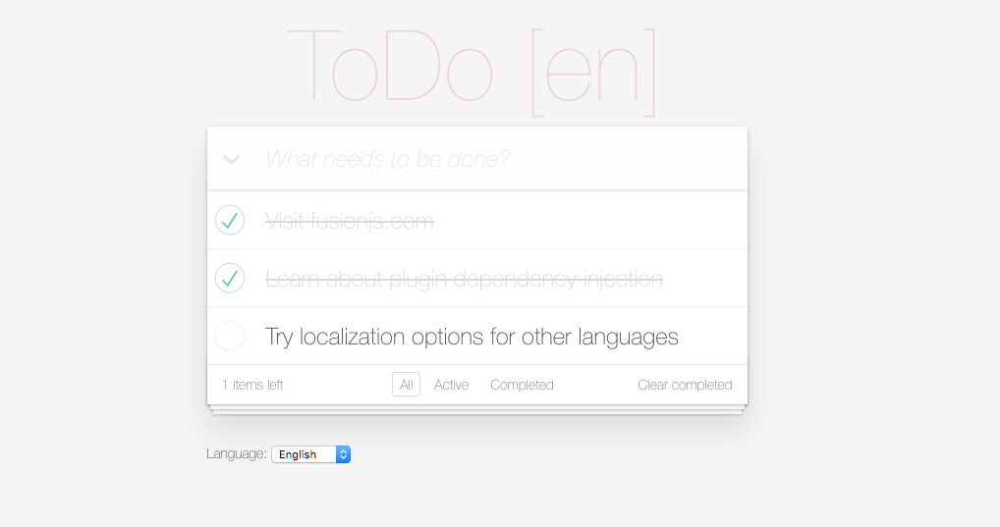
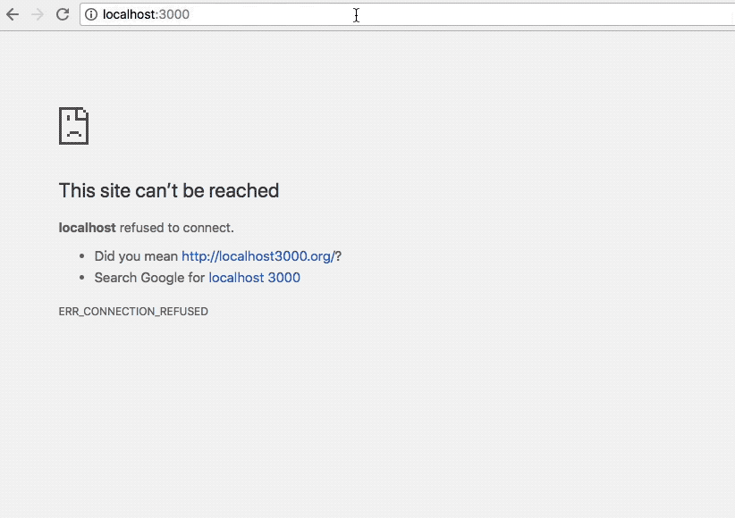

# Fusion.js Todo Boilerplate

This repository is an example implementation of a [Fusion.js](https://fusionjs.com/) application that includes:

- Localization and Translations
  - Uses [fusion-plugin-i18n-react](https://fusionjs.com/api/fusion-plugin-i18n-react) for easy usage within React
  - Supports English, German, French, and Japanese locales
  - Dynamically redirects users to correct locale based on `accept-language` header
  - Allows specific language selection with locale urls
    - i.e. `/en-US` will force english translations
- Custom Plugin Creation
  - A custom [fusion plugin](https://fusionjs.com/api/fusion-docs/creating-a-plugin) provides [todomvc-app-css](https://www.npmjs.com/package/todomvc-app-css) styling as well as locale specific redirects





## Running Locally

```bash
# Install dependencies
yarn install

# Run in development mode
yarn dev
```

## ToDo

- There are currently 0 tests in this repo :cry:
  - In the future, [fusion test utils](https://fusionjs.com/api/fusion-test-utils) should be used to cover the logic within the custom `TodoPlugin`
- The url redirect logic should probably live within a custom `I18nLoader` implementation, but some logic is leaking out of the `__NODE__` boundary and being ran in the client when that is attempted.
